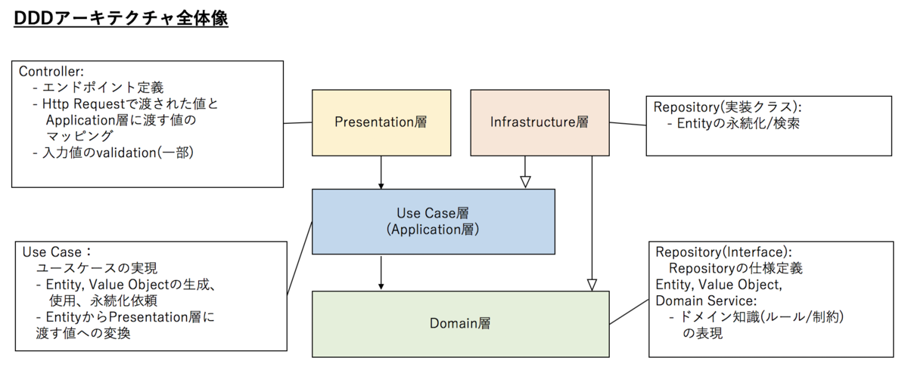

### アーキテクチャ



* 本プロジェクトは上の図で示した**オニオンアーキテクチャ**に従う
* ディレクトリ構造
  * domain → Domain層: `Domainモデル、Repositoryインタフェース、Usecaseインタフェース`
  * usecase → Use Case層: `Usecaseインタフェースの実装`
  * infrastructure → Infrastructure層: `DBドライバー、Repositoryインタフェースの実装`
  * presentation → Presentation層: `http RESTfulハンドラとgRPCハンドラの実装`
  * injector: `各層の依存性注入用関数の実装`
  * app: `アプリケーションの設定と起動関連`
  * migrations: `スキーマ定義と初期データ投入用のDBマイグレーションスクリプト`
  * vendor: `コンテナ起動高速化のためのダウンロード済みサードパーティーライブラリ`


### アプリケーション起動方法

```bash
docker-compose up -d
curl localhost:8080 # RESTfulハンドラ使用時のヘルスチェック
```


### FAQ

* RESTfulハンドラとgRPCハンドラの切り替え方法は？

  `Dockerfile`の`CMD ["./webapp", "-dbhost", "db"]`を`CMD ["./webapp", "-dbhost", "db", "-use_grpc=false"]`に、`docker-compose.yml`で解放ポートを8080に変更すれば切り替えられる。

  

* エラーや障害によってリクエストが再送される場合の対処法は？

  残高加減算処理時、一意の取引ID`transaction_id`が必要で、再送される場合はエラーメッセージを返すようにしている。

  

* 残高加減算のデータ整合性はどのように実現されている？

  残高加減算処理と取引履歴の挿入はDBトランザクションを使用してデータ整合性を実現している。


### gRPC APIの使用方法

インタフェースの定義は`presentation/grpc/proto/user_balance.proto`から確認できる。`protoc`で各言語のコードが生成できる。`Go`の生成コードの使用方法は以下になる。

```go
package main

import (
	"context"
	"fmt"
	"log"

	"github.com/kaitolucifer/grpc-client/proto" // 生成コード
	"google.golang.org/grpc"
)

func main() {	
	conn, err := grpc.Dial("localhost:50051", grpc.WithInsecure())
	if err != nil {
		log.Fatalf("could not connect: %v", err)
	}
  defer conn.Close()
  
  client := proto.NewUserBalanceClient(conn)
	req := &proto.GetUserBalanceRequest{
		UserId: "test_user1",
	}
	res, err := client.GetBalanceByUserID(context.Background(), req)
	if err != nil {
		log.Fatalf("error while calling gRPC: %s", err)
	}
  fmt.Println(res.GetBalance())
  
}
```


### RESTful APIドキュメンテーション

* **ヘルスチェック**

  * URL

    `/`

  * メソッド:

    `GET`

  * URLパラメータ:

    `None`

  * Body:

    `None`

  * レスポンス:

    * 200

      ```json
      {
        "status": "success",
        "message": "healthy"
      }
      ```

* **残高参照**

  * URL

    `/balance/{user_id}`

  * メソッド:

    `GET`

  * URLパラメータ:

    `user_id: int`

  * Body:

    `None`

  * レスポンス:

    * 200

      ```json
      {
        "status": "success",
        "balance": 1000
      }
      ```

    * 400 / 404

      ```json
      {
        "status": "fail",
        "message": "message"
      }
      ```
      
    * 500
    
      ```json
      {
        "status": "error",
        "message": "message"
      }
      ```
  
* **残高加算**

  * URL

    `/balance/add/{user_id}`

  * メソッド:

    `PATCH`

  * URLパラメータ:

    `user_id: int`

  * Body:

    ```json
    {
    	"amount": 1000,
    	"transaction_id": "unique transaction_id"
    }
    ```
  
  * レスポンス:
  
    * 200
  
      ```json
      {
        "status": "success",
        "message": "user balance has been added successfully"
      }
      ```
  
    * 400 / 404 / 422
  
      ```json
      {
        "status": "fail",
         "message": "message"
      }
      ```
      
    * 500
    
      ```json
      {
        "status": "error",
        "message": "message"
      }
      ```

* **残高減算**

  * URL

    `/balance/reduce/{user_id}`

  * メソッド:

    `PATCH`

  * URLパラメータ:

    `user_id: int`

  * Body:

    ```json
    {
    	"amount": 1000,
    	"transaction_id": "unique transaction_id"
    }
    ```
  
  * レスポンス:
  
    * 200
  
      ```json
      {
        "status": "success",
        "message": "user balance has been added successfully"
      }
      ```
  
    * 400 / 404 / 409 / 422
  
      ```json
      {
        "status": "fail",
        "message": "message"
      }
      ```
      
    * 500
    
      ```json
      {
        "status": "error",
        "message": "message"
      }
      ```

* **残高一斉加算**

  * URL

    `/balance/add-all`

  * メソッド:

    `PATCH`

  * URLパラメータ:

    `None`

  * Body:

    ```json
    {
    	"amount": 1000,
    	"transaction_id": "unique transaction_id"
    }
    ```
  
  * レスポンス:
  
    * 200
  
      ```json
      {
        "status": "success",
        "message": "user balance has been added successfully"
      }
      ```
  
    * 400 / 404 / 422
  
      ```json
      {
        "status": "fail",
        "message": "message"
      }
      ```
      
    * 500
    
      ```json
      {
        "status": "error",
        "message": "message"
      }
      ```

